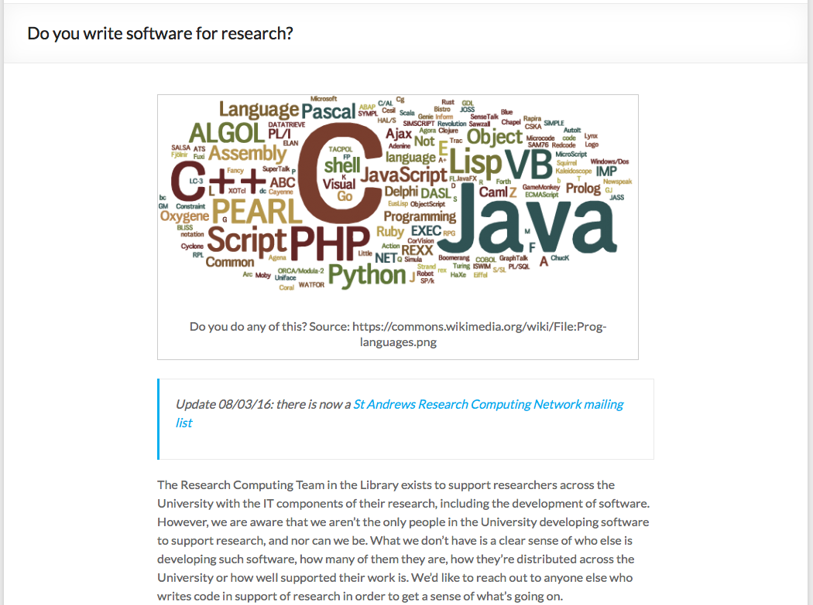

class: center, middle, inverse

# St Andrews Research Computing Network: Introduction

## Paddy McCann

### Research Computing, The Library

### 14 June 2016

???

Housekeeping... Safety announcements?

---

# Research Computing Service

- Started as a service providing support to Arts and Humanities researchers
- 2012 - renamed "Research Computing", remit expanded to all researchers
- 2015 - moved from IT Services to the Library's Digital Research Division
- 2.5 Developers
 - Patrick McCann
 - Swithun Crowe
 - Mary Woodcock Kroble

---

# Beyond the Research Computing Service

- Clearly not doing all the research software development for the University
 - Who is?
 - Where are they?
 - What are they doing?
 - What support do they have?
- **What can we do to improve research software across the University?**

???

What positions do developers hold? What kind of work are they doing? Are they isolated? What support is available at the School and University level?

---

class: inverse

# Do you write software for research?

???

Had a few informal chats before this, but this was posted on the Library Blog on 22 February. We had a handful of responses, then Mary sent it out to School administrators and computing officers - quickly had more than 40. Lots of comments, and a fair amount of enthusiasm. Some one complained that Fortran was missing from the word cloud, so...

Blogpost at http://www.st-andrews.ac.uk/libraryblog/2016/02/do-you-write-software-for-research/

---

# Do you write software for research?

???

Responses from
- Maths and Statistics
- History
- Geography & Geosciences
- Computer Science
- Philospohical
- Anthropological and Film Studies
- IT Services
- Psychology & Neuroscience
- Physics & Astronomy
- Medicine
- Biology
A number of these from CIRCA, CREEM, SMRU

Blogpost at http://www.st-andrews.ac.uk/libraryblog/2016/03/research-computing-network-update/

---

class: center, middle

I'm not really a developer, I just...

...does that count?

???

- This has come up in conversations I've had with individuals and in responses to the blogpost.
- People who "just" write R scripts, or LabVIEW, or think their code isn't up to some level of quality or elegance
- The answer is always...

---

class: center, middle, inverse

# Yes

???

If you do **any** software development or write **any** code as part of your contribution to research at this University, then we want to hear from you. Even if you just want to do that, but don't at the moment, we want to hear from you. There will be things that you can learn from the other members of this network and there will probably be things you can teach them.

---

class: center, middle

# Applications Developer (Research Computing)

???

That's my job title. I should probably check this, but I'm willing to bet that I'm one of very few people in the network, never mind this room, with the 'D' word in their job title. For a significant number, software development won't be in their job description and the software they produce won't necessarily help them progress in their career. Research data is gaining acceptability as a first-class research output; software is some way behind that. Alex will talk a bit more about this when he discusses the Software Sustainability Institute and their Research Software Engineers campaign, but for now just note that if research software development is something that you need to do but which isn't always recognised as an important part of your job, you're not alone.

---

# Now what?

1. Blog post &#10004;
2. Mailing list &#10004;
3. Launch event
3. ...

???

- What do we use this mailing list for?
 - I'd like to find out a bit more detail on what it's like to develop software for research at the University - what support do you get vs what support do you need?
 - But how can you benefit from this network, from the expertise of your colleagues?
  - What discussions should we be having?
  - Where should we be having them, if not on the list?
   - Other platforms (e.g. Slack)
   - In the Pub?
 - What about training (e.g. Virtualisation, Software Licensing, Version Control)?
 - Other events?
 - Developing guidance or even University policy?

---

# Central Services

- The Applications Team (and others) in IT Services use self-hosted instances of
 - Git
 - Jira
 - Jenkins CI

Would these be of use?

???

These (particularly Git and Jira) could be opened up to use by others in the University if they would be of use. The Git setup is plain Git, accessed via client software once your SSH public key has been added. Need to contact the IT Service desk to get a repository created. Jira is a commercial product, with the cost of the license linked to user numbers. Again, creating a project requires going to the IT Service Desk.

---

class: inverse

# Next

- Talks
 - Alex Konovalov - The Software Sustainability Institute, Software Carpentry and RSEs
 - Roman Spesyvtsev - Why do I write code? Coding platforms for an experimental physicist
 - Rob Schick - Using R, RStudio, and git to Support a Reproducible Research Workflow
 - Swithun Crowe - Become a Solr power user: getting the most out of Solr
 - Ken Munro - Vim: Why Not?
- Break
- Discussion

---

class: center, middle, inverse

# Thank-you

## pgm5@st-andrews.ac.uk

(made using remarkjs.com)
